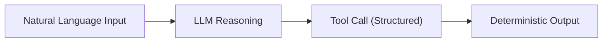

# Factor 1: Natural Language to Tool Calls

## Overview

This example demonstrates how the Mastra agent implementation fulfills **Factor 1: Natural Language to Tool Calls** from the [12-Factor Agents methodology](https://github.com/humanlayer/12-factor-agents/blob/main/content/factor-01-natural-language-to-tool-calls.md).

## What Factor 1 Means

Factor 1 states that the LLM's primary role should be to parse natural language instructions and translate them into structured, executable tool calls. This elevates the LLM from a simple text generator to an intelligent router that bridges human intent and programmatic actions.

## How This Example Fulfills Factor 1

### 🗺️ Natural Language to Tool Call Flow



_Figure: The LLM parses natural language, determines the appropriate tool call, and deterministic code executes the tool, producing a reliable output._

### 🔄 Natural Language Input → Structured Tool Call

```typescript
// Natural language question
const result = await agent.generate('What is the capital of South Dakota?');
```

The agent receives a natural language question and internally converts it into a structured tool call:

```typescript
const lookupTool = createTool({
  id: 'lookup',
  inputSchema: z.object({ search: z.string() }),
  description: 'Looks up a value for a given search string',
  execute: async ({ context }) => {
    console.log('[lookupTool] Got command:', context.search);
    return { result: 'Pierre' };
  },
});
```

### 🎯 Key Implementation Details

1. **Structured Input Schema**: The tool defines clear input requirements using Zod schema validation
2. **Deterministic Execution**: Once the LLM decides to call the tool, the execution is completely deterministic
3. **Clear Separation**: The LLM handles reasoning and decision-making, while the tool handles execution
4. **Typed Interface**: Type-safe tool definitions ensure reliability

### 🏗️ Architecture Benefits

- **Reliability**: Tool execution is deterministic and predictable
- **Maintainability**: Tools can be tested independently of the LLM
- **Scalability**: New tools can be added without changing LLM logic
- **Debuggability**: Tool calls are logged and traceable

## Related Factors

This example sets the foundation for other 12-factor principles:

- **Factor 4** (Tools are Structured Outputs) - demonstrates how tools consume structured data
- **Factor 8** (Own Your Control Flow) - shows deterministic tool execution
- **Factor 10** (Small, Focused Agents) - single-purpose lookup agent

## Best Practices Demonstrated

1. ✅ **Clear tool descriptions** help the LLM understand when to use each tool
2. ✅ **Type-safe schemas** prevent runtime errors
3. ✅ **Logging** provides visibility into tool execution
4. ✅ **Simple, focused tools** are easier to reason about and maintain

This implementation shows how Mastra enables clean separation between LLM reasoning and deterministic tool execution, fulfilling the core principle of Factor 1.

## Usage

You can run this example from the command line, providing your question as an argument or interactively:

```sh
pnpm exec tsx src/factor01-natural-language-to-tool-calls/index.ts -- 'Who was Ada Lovelace?'
```

If you do not provide a question, you will be prompted to enter one interactively.

### Example Output

```
[lookupTool] Got command: Ada Lovelace
Got response: Ada Lovelace was an English mathematician and writer, chiefly known for her work on Charles Babbage's proposed mechanical general-purpose computer, the Analytical Engine. She was the first to recognise that the machine had applications beyond pure calculation, and published the first algorithm intended to be carried out by such a machine. As a result, she is sometimes referred to as the first to recognise the full potential of computers.
```
