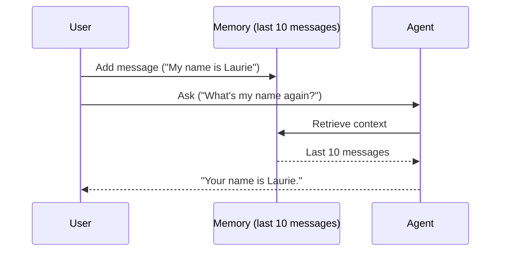

# Factor 3: Own Your Context Window

## Overview

This example demonstrates how the Mastra agent implementation fulfills **Factor 3: Own Your Context Window** from the [12-Factor Agents methodology](https://github.com/humanlayer/12-factor-agents/blob/main/content/factor-03-own-your-context-window.md).

## What Factor 3 Means

Factor 3 emphasizes that developers should have explicit control over what information gets included in the LLM's context window. Rather than letting the framework automatically manage context, you should deliberately choose what conversation history, relevant facts, and contextual information to include based on your application's specific needs.

## How This Example Fulfills Factor 3

### 🧠 Explicit Memory Configuration

```typescript
const memory = new Memory({
  storage: new LibSQLStore({
    url: ':memory:', // Use in-memory storage for this demo
  }),
  options: { lastMessages: 10 }, // Explicit control: only last 10 messages
});
```

The example explicitly configures memory to keep only the **last 10 messages**, demonstrating direct control over context window size.

### 🔗 Thread-Based Context Management

```typescript
const threadId = 'factor03-demo-thread';
const resourceId = 'factor03-demo-user';

await agent.generate('My name is Laurie', {
  threadId,
  resourceId,
});
```

By using `threadId` and `resourceId`, we explicitly manage conversation context and ensure memory persistence works correctly.

### 📝 Controlled Information Retrieval

```typescript
// Later calls automatically access relevant context
const result = await agent.generate("What's my name again?", {
  threadId,
  resourceId,
});
// Agent correctly recalls: "Your name is Laurie"
```

The agent can recall information from earlier in the conversation because we've explicitly configured the context window management.

### 🧠 Context Window Management



_Figure: User messages are stored in memory. The agent retrieves the relevant context window to answer questions accurately._

## Architecture Benefits

### 🎯 **Precise Context Control**

- Configure exactly how many messages to retain
- Choose what information deserves context window space
- Prevent context overflow with large conversations

### 📊 **Predictable Behavior**

- Know exactly what information the agent has access to
- Debug issues by examining the controlled context
- Consistent performance across different conversation lengths

### 🔧 **Flexible Configuration**

- Adjust `lastMessages` based on your use case
- Use different storage providers (file, database, memory)
- Customize memory behavior per agent or conversation type

## Best Practices

### ✅ **Do This**

- Set explicit limits on context window size
- Use appropriate storage for your persistence needs
- Provide clear `threadId` and `resourceId` for conversation tracking
- Configure memory options based on your specific requirements

### ❌ **Avoid This**

- Letting memory grow unbounded
- Using default configurations without understanding their impact
- Forgetting to provide thread/resource identifiers
- Ignoring storage configuration requirements

## Related Factors

- **Factor 5: Unify Execution State** - Uses similar memory patterns for state management
- **Factor 1: Natural Language to Tool Calls** - Context window affects tool call accuracy
- **Factor 4: Tools are Structured Outputs** - Structured data in context improves reliability

## Design Considerations

The key insight of Factor 3 is that **context windows are a limited, valuable resource**. By taking explicit control over what information gets included, you can:

1. **Optimize Performance**: Smaller, focused context windows are faster and cheaper
2. **Improve Accuracy**: Relevant information is more likely to be used correctly
3. **Enable Debugging**: You know exactly what the agent can "see"
4. **Scale Effectively**: Context management strategies work across different conversation lengths

This Mastra implementation showcases how memory configuration, thread management, and storage providers work together to give you complete control over your agent's context window.

## Usage

You can run this example from the command line, providing your name as an argument or interactively:

```sh
pnpm exec tsx src/factor03-own-your-context-window/index.ts -- 'Laurie'
```

If you do not provide a name, you will be prompted to enter one interactively.

### Example Output

```text
Agent response (recall): Your name is Laurie.
Agent response (recall 2): Your name is Laurie.
```
