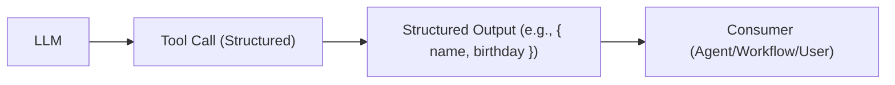

# Factor 4: Tools are Structured Outputs

## Overview

This example demonstrates how the Mastra agent implementation fulfills **Factor 4: Tools are Structured Outputs** from the [12-Factor Agents methodology](https://github.com/humanlayer/12-factor-agents/blob/main/content/factor-04-tools-are-structured-outputs.md).

## What Factor 4 Means

Factor 4 defines tools as specific, structured data formats that the LLM is trained to produce. Rather than having the LLM directly execute actions, it generates clear, parseable output that represents a tool call. This separation ensures the LLM focuses on reasoning while deterministic code handles execution.

## How This Example Fulfills Factor 4

### 🏗️ Structured Output Flow



_Figure: The LLM generates a structured tool call, deterministic code executes it, and the structured output is consumed by the next step or user._

### 🏗️ Structured Tool Definition

```typescript
const famousPersonTool = createTool({
  id: 'famous-person',
  inputSchema: z.object({ category: z.string().optional() }),
  outputSchema: z.object({
    name: z.string(),
    birthday: z.string(),
  }),
  description:
    'Returns a famous person and their birthday, optionally filtered by category',
  execute: async ({ context }) => {
    // Use the category input to determine which person to return
    const category = context.category || 'default';
    if (
      category.toLowerCase().includes('math') ||
      category.toLowerCase().includes('computer')
    ) {
      return { name: 'Ada Lovelace', birthday: '1815-12-10' };
    } else if (category.toLowerCase().includes('science')) {
      return { name: 'Marie Curie', birthday: '1867-11-07' };
    } else {
      return { name: 'Ada Lovelace', birthday: '1815-12-10' };
    }
  },
});
```

### 🎯 Schema-Driven Outputs

```typescript
// LLM generates a tool call, deterministic code executes it
const result = await agent.generate(
  'Give me a famous person and their exact date of birth',
);

// Structured output is guaranteed by schema
const toolResult = result.toolResults?.find(
  (tr) => tr.toolName === 'famous-person',
);
console.log('Tool output:', toolResult.result); // { name: string, birthday: string }
```

### 🔧 Key Implementation Details

1. **Input Schema Validation**: `z.object({ category: z.string().optional() })` defines expected inputs
2. **Output Schema Enforcement**: `z.object({ name: z.string(), birthday: z.string() })` guarantees structure
3. **Deterministic Execution**: The `execute` function runs predictably based on inputs
4. **Type Safety**: Zod schemas provide compile-time and runtime type checking

### 🏗️ Architecture Benefits

- **Predictability**: Output structure is guaranteed by schema validation
- **Type Safety**: Both input and output are strongly typed
- **Testability**: Tools can be unit tested independently
- **Debuggability**: Clear structure makes tool outputs easy to inspect
- **Reliability**: Schema validation prevents malformed data

## Best Practices Demonstrated

### ✅ Clear Tool Purpose

```typescript
description: 'Returns a famous person and their birthday, optionally filtered by category';
```

- Helps LLM understand when to use the tool
- Documents expected behavior

### ✅ Strong Schema Definitions

```typescript
inputSchema: z.object({ category: z.string().optional() }),
outputSchema: z.object({
  name: z.string(),
  birthday: z.string(),
});
```

- Enforces consistent input and output structure
- Provides type safety and validation

### ✅ Separation of Concerns

```typescript
// LLM decides WHEN to call the tool and WHAT parameters to pass
// Deterministic code defines HOW the tool processes inputs and WHAT it returns
execute: async ({ context }) => {
  const category = context.category || 'default';
  // ... deterministic logic based on input
};
```

### ✅ Result Inspection

```typescript
const toolResult = result.toolResults?.find(
  (tr) => tr.toolName === 'famous-person',
);
if (toolResult && toolResult.result) {
  console.log('Tool output:', toolResult.result);
}
```

- Allows access to structured tool outputs
- Enables further processing of results

## Schema Design Patterns

### Simple Data Return

```typescript
outputSchema: z.object({
  value: z.string(),
  confidence: z.number(),
});
```

### Complex Nested Structures

```typescript
outputSchema: z.object({
  person: z.object({
    name: z.string(),
    birthDate: z.string(),
    occupation: z.string(),
  }),
  metadata: z.object({
    source: z.string(),
    confidence: z.number(),
  }),
});
```

### Array Outputs

```typescript
outputSchema: z.object({
  results: z.array(
    z.object({
      name: z.string(),
      score: z.number(),
    }),
  ),
});
```

## Anti-Patterns Avoided

❌ **Unstructured Text Output**: No raw string returns that require parsing
❌ **LLM-Executed Actions**: No direct execution by the LLM
❌ **Untyped Interfaces**: No loose or dynamic output structures
❌ **Hidden Side Effects**: All tool behavior is explicit and contained

## Related Factors

This example connects to other 12-factor principles:

- **Factor 1** (Natural Language to Tool Calls) - tools receive structured input
- **Factor 8** (Own Your Control Flow) - deterministic tool execution
- **Factor 9** (Compact Errors) - structured error handling in tools

## Tool Design Considerations

1. **Schema Completeness**: Define all required and optional fields
2. **Type Specificity**: Use precise types (string, number, boolean, etc.)
3. **Validation Rules**: Include constraints like min/max values, string patterns
4. **Error Handling**: Consider how tools report errors in their output schema
5. **Backward Compatibility**: Design schemas that can evolve over time

This implementation demonstrates how Mastra enforces structured outputs through strong typing and schema validation, ensuring tools produce consistent, parseable results that can be reliably processed by your application.

## Usage

You can run this example from the command line, providing your question as an argument or interactively:

```sh
pnpm exec tsx src/factor04-tools-are-structured-outputs/index.ts -- 'Tell me about a famous mathematician'
```

If you do not provide a question, you will be prompted to enter one interactively.

### Example Output

```text
Agent response (structured): Ada Lovelace was born on December 10, 1815.
Calculator agent response: The result of (3 * 4) + 2 is 14.
Agent response (structured): Ada Lovelace was born on December 10, 1815. She is often considered the first computer programmer. Lovelace worked on Charles Babbage's proposed mechanical general-purpose computer, the Analytical Engine. She published an algorithm for the engine to calculate a sequence of Bernoulli numbers, which is considered the first published algorithm intended to be carried out by a machine.
Calculator agent response: The result of (3 * 4) + 2 is 14.
```
