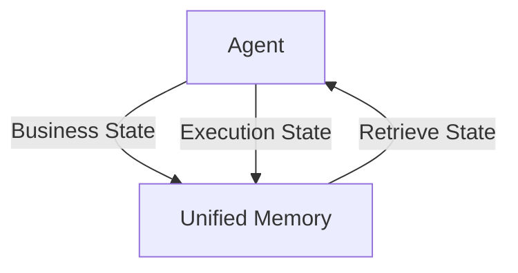

# Factor 5: Unify Execution State and Business State

## Overview

This example demonstrates how the Mastra agent implementation fulfills **Factor 5: Unify Execution State and Business State** from the [12-Factor Agents methodology](https://github.com/humanlayer/12-factor-agents/blob/main/content/factor-05-unify-execution-state.md).

## What Factor 5 Means

Factor 5 advocates for using a single, unified container to manage both execution state (how the agent is running) and business state (domain-specific information). Rather than maintaining separate systems for workflow state and application data, everything should be stored and accessed through one consistent interface.

## How This Example Fulfills Factor 5

### 🗃️ Unified State Container



_Figure: Both business and execution state are stored and retrieved from a single unified memory container._

```typescript
// Single Memory instance serves as unified state container
const memory = new Memory({
  storage: new LibSQLStore({
    url: ':memory:', // Use in-memory storage for this demo
  }),
  options: { lastMessages: 10 },
});

const agent = new Agent({
  name: 'Stateful Agent',
  instructions: `Remember the user's name if they tell you, and recall it when asked.`,
  model,
  memory, // Unified state management
});
```

Mastra's Memory serves as the single source of truth for both execution context and business information.

### 🔗 Thread-Based State Management

```typescript
// Consistent state identifiers across all operations
const threadId = 'factor05-demo-thread';
const resourceId = 'factor05-demo-user';

// Set business state
await agent.generate('Hi, my name is Laurie!', {
  threadId,
  resourceId,
});

// Retrieve business state
await agent.generate('What is my name?', {
  threadId,
  resourceId,
});
```

Using consistent `threadId` and `resourceId` ensures that execution state and business state are properly unified and persistent.

### 📊 State Persistence Demonstration

```typescript
// Store business information
await agent.generate('Hi, my name is Laurie!', { threadId, resourceId });
// Output: "Hello Laurie, it's nice to meet you..."

// Retrieve stored information
await agent.generate('What is my name?', { threadId, resourceId });
// Output: "Your name is Laurie."

// Verify persistence
await agent.generate('Remind me of my name.', { threadId, resourceId });
// Output: "You told me earlier that your name is Laurie."
```

The agent successfully maintains state across multiple interactions, demonstrating unified state management.

## Architecture Benefits

### 🎯 **Single Source of Truth**

- All state (execution + business) stored in one place
- Consistent access patterns for any type of information
- Simplified debugging and state inspection

### 📈 **Scalable State Management**

- Works for simple name storage or complex business workflows
- Supports different storage backends (memory, file, database)
- Handles state across multiple conversation turns

### 🔍 **Transparent State Access**

- Clear visibility into what information is stored
- Predictable state retrieval patterns
- Easy to reason about state changes over time

## Implementation Patterns

### ✅ **Customer Support Scenario**

```typescript
// Unified storage for customer context and conversation state
await agent.generate('Customer ID: 12345, Issue: Login problems', {
  threadId: 'support-session-abc',
  resourceId: 'customer-12345',
});

await agent.generate('What was the customer issue again?', {
  threadId: 'support-session-abc',
  resourceId: 'customer-12345',
});
// Agent recalls: "The customer (ID: 12345) reported login problems"
```

### ✅ **E-commerce Workflow**

```typescript
// Business state (cart) and execution state (conversation) unified
await agent.generate('Add 2 laptops to my cart', {
  threadId: 'shopping-session-xyz',
  resourceId: 'user-789',
});

await agent.generate('What's in my cart?', {
  threadId: 'shopping-session-xyz',
  resourceId: 'user-789',
});
// Agent recalls cart contents from unified state
```

### ✅ **Content Management**

```typescript
// Document state and workflow state in same container
await agent.generate(
  'Create draft: "AI in Healthcare" with focus on diagnostics',
  {
    threadId: 'content-project-456',
    resourceId: 'author-writer1',
  },
);

await agent.generate('What was the document topic?', {
  threadId: 'content-project-456',
  resourceId: 'author-writer1',
});
// Agent recalls document requirements from state
```

## Best Practices

### ✅ **Do This**

- Use consistent thread and resource identifiers
- Configure appropriate storage for your persistence needs
- Store all related state in the unified memory container
- Design state access patterns that work for both execution and business needs

### ❌ **Avoid This**

- Maintaining separate storage systems for different types of state
- Using different identifiers for related state operations
- Forgetting to configure proper storage for persistence
- Mixing stateful and stateless patterns inconsistently

## Advanced Patterns

### 🔄 **State Migration**

```typescript
// Transfer state between agents while maintaining unity
const handoffContext = await sourceAgent.getMemory().getThreadById(threadId);
await targetAgent.generate(userMessage, {
  threadId: newThreadId,
  resourceId,
  // Preserve unified state across agent transitions
});
```

### 📊 **State Inspection**

```typescript
// Access unified state for debugging or analytics
const stateSnapshot = await memory.getThreadById(threadId);
// Contains both execution history and business data
```

### 🏗️ **Multi-Agent State Sharing**

```typescript
// Multiple agents sharing the same unified state container
const sharedMemory = new Memory(/* same config */);
const customerAgent = new Agent({ memory: sharedMemory });
const orderAgent = new Agent({ memory: sharedMemory });
// Both agents access the same unified state
```

## Anti-Patterns Avoided

### ❌ **State Fragmentation**

```typescript
// DON'T: Separate systems for execution vs business state
const executionState = new WorkflowStateManager();
const businessState = new DatabaseManager();
// Creates inconsistency and complexity
```

### ❌ **Stateless Business Logic**

```typescript
// DON'T: Losing business context between calls
await agent.generate('Remember my preferences');
await agent.generate('What are my preferences?'); // Without proper state management
// Leads to context loss and poor user experience
```

## Related Factors

- **Factor 3: Own Your Context Window** - Context window management affects state retrieval
- **Factor 6: Launch/Pause/Resume** - Workflow state is part of unified state
- **Factor 8: Own Your Control Flow** - Execution state tracking supports control flow

## Design Considerations

The essence of Factor 5 is **eliminating the artificial separation** between "how things run" and "what things know". In traditional architectures, you might have:

- Workflow engines managing execution state
- Databases managing business state
- Session stores managing user state
- Cache layers managing performance state

With unified state, all of this information lives in one accessible, consistent container. This leads to:

1. **Simpler Architecture**: Fewer moving parts to coordinate
2. **Better Debugging**: One place to examine all relevant state
3. **Easier Testing**: Predictable state setup and verification
4. **Flexible Scaling**: State management scales uniformly

This Mastra implementation demonstrates how Memory, combined with proper thread/resource management, creates a natural unified state container that scales from simple name storage to complex multi-agent business workflows.

## Usage

You can run this example from the command line, providing your message as an argument or interactively:

```sh
pnpm exec tsx src/factor05-unify-execution-state/index.ts -- 'My name is Laurie'
```

If you do not provide a message, you will be prompted to enter one interactively.

### Example Output

```text
Agent: Got it, Laurie! I'll remember your name. If you need anything or want to chat, just let me know.
```
