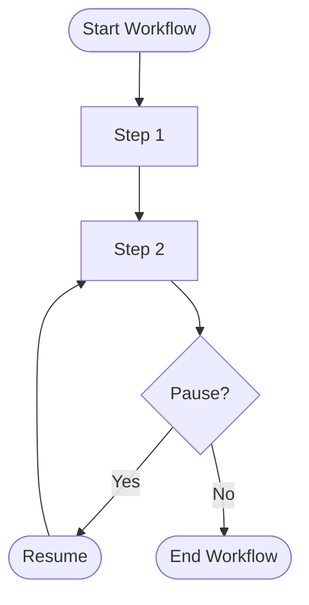

# Factor 6: Launch/Pause/Resume with Simple APIs

## Overview

This example demonstrates how the Mastra workflow implementation fulfills **Factor 6: Launch/Pause/Resume with Simple APIs** from the [12-Factor Agents methodology](https://github.com/humanlayer/12-factor-agents/blob/main/content/factor-06-launch-pause-resume.md).

## What Factor 6 Means

Factor 6 advocates for agent workflows that can be launched, paused, and resumed with simple, intuitive APIs. This enables long-running processes, human intervention points, and recovery from failures without losing progress or requiring complex state reconstruction.

## How This Example Fulfills Factor 6

### 🚀 Simple Launch API

```typescript
// Create and start a workflow with minimal setup
const run = myWorkflow.createRun();
const result = await run.start({ inputData: { inputValue: 45 } });
```

### ⏸️ Automatic Pause/Suspend

```typescript
const stepTwo = createStep({
  id: 'stepTwo',
  inputSchema: z.object({ doubled: z.number() }),
  outputSchema: z.object({ incremented: z.number() }),
  async execute({ inputData, suspend }) {
    if (inputData.doubled < 100) {
      await suspend({}); // Pauses the workflow here
      return { incremented: 0 };
    }
    return { incremented: inputData.doubled + 1 };
  },
});
```

### 🔄 Resume Capability

```typescript
if (result.status === 'suspended') {
  console.log('Workflow suspended, waiting for resume...');
  // Resume workflow with new data when ready
  // const resumed = await run.resume({ inputData: { doubled: 200 } });
}
```

### 🔧 Key Implementation Details

1. **Simple Start API**: `run.start()` launches workflows with clear input data
2. **Conditional Suspension**: `suspend()` function pauses execution at specific points
3. **Status Checking**: Result status indicates whether workflow completed or suspended
4. **Resume Readiness**: Infrastructure prepared for workflow resumption
5. **State Preservation**: Workflow state maintained during suspension

### 🏗️ Architecture Benefits

- **Interruption Handling**: Graceful handling of pauses without losing progress
- **Human Intervention**: Enable human input or approval points in workflows
- **Failure Recovery**: Resume from failures without restarting entire process
- **Resource Management**: Pause long-running workflows to free resources
- **Scalability**: Handle workflows that exceed single execution timeframes

## Best Practices Demonstrated

### ✅ Conditional Suspension Logic

```typescript
if (inputData.doubled < 100) {
  await suspend({}); // Clear condition for when to pause
}
```

- Explicit conditions determine when to pause
- Business logic drives suspension decisions

### ✅ Status-Based Flow Control

```typescript
if (result.status === 'suspended') {
  console.log('Workflow suspended, waiting for resume...');
} else if (result.status === 'success') {
  // Handle successful completion
}
```

- Clear status indicators for different execution states
- Enables appropriate handling of each state

### ✅ Step-Based Architecture

```typescript
const myWorkflow = createWorkflow({
  steps: [stepOne, stepTwo],
})
  .then(stepOne)
  .then(stepTwo)
  .commit();
```

- Modular steps enable precise suspension points
- Each step can implement its own suspension logic

## Workflow Lifecycle Patterns

### Simple Launch

```typescript
const run = workflow.createRun();
const result = await run.start({ inputData });
```

### Conditional Pause

```typescript
async execute({ inputData, suspend }) {
  if (needsHumanApproval(inputData)) {
    await suspend({ reason: 'awaiting approval' });
  }
  return processData(inputData);
}
```

### Resume with Context

```typescript
// When resuming, provide updated context
const resumed = await run.resume({
  inputData: { ...originalData, approved: true },
});
```

## Anti-Patterns Avoided

❌ **Complex Lifecycle APIs**: No complicated state management or workflow orchestration
❌ **Lost Progress**: No need to restart workflows from the beginning
❌ **Manual State Reconstruction**: No complex serialization/deserialization requirements
❌ **Resource Leaks**: No hanging processes or memory leaks during suspension

## Related Factors

This example connects to other 12-factor principles:

- **Factor 5** (Unify Execution State) - workflow state includes business state
- **Factor 7** (Contact Humans with Tools) - suspension enables human interaction
- **Factor 8** (Own Your Control Flow) - explicit control over workflow progression
- **Factor 9** (Compact Errors) - error handling in suspended workflows

## Workflow Design Considerations

1. **Suspension Points**: Identify logical places where workflows can pause
2. **State Management**: Ensure workflow state is properly preserved
3. **Resume Logic**: Design clear paths for workflow resumption
4. **Timeout Handling**: Consider how long workflows can remain suspended
5. **Error Recovery**: Handle errors that occur during suspension/resumption

## Use Cases for Launch/Pause/Resume

### Long-Running Processes

```typescript
// Data processing that might take hours
async execute({ inputData, suspend }) {
  for (const batch of largeDatSet) {
    processBatch(batch);
    if (shouldPause()) {
      await suspend({ progress: currentProgress });
    }
  }
}
```

### Human Approval Workflows

```typescript
// Workflows requiring human approval
async execute({ inputData, suspend }) {
  if (requiresApproval(inputData)) {
    await suspend({ pendingApproval: inputData });
  }
  return approvedAction(inputData);
}
```

### External Dependency Workflows

```typescript
// Workflows waiting for external services
async execute({ inputData, suspend }) {
  if (!externalServiceReady()) {
    await suspend({ waitingFor: 'external-service' });
  }
  return callExternalService(inputData);
}
```

This implementation demonstrates how Mastra workflows provide simple, intuitive APIs for launching, pausing, and resuming agent processes, enabling robust handling of long-running tasks and human intervention points.

## Usage

You can run this example from the command line, providing a number as an argument or interactively:

```sh
pnpm exec tsx src/factor06-launch-pause-resume/index.ts -- 42
```

If you do not provide a number, you will be prompted to enter one interactively.

### Example Output

```text
Improved workflow execution result: suspended
Workflow suspended for clarification, resuming with valid input...
Resumed workflow status: suspended
```

## How This Example Fulfills Factor 6

### 🔄 Workflow Lifecycle



_Figure: The workflow can be paused (suspended) and resumed, preserving state and enabling human or external intervention._
