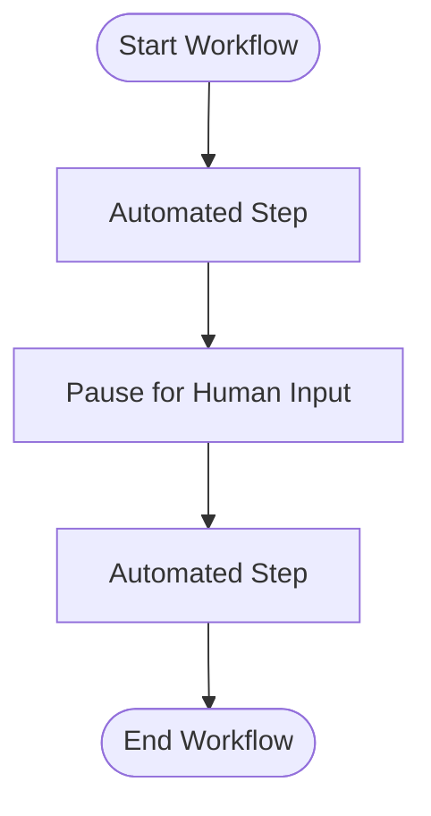

# Factor 7: Contact Humans with Tools

## Overview

This example demonstrates how the Mastra workflow implementation fulfills **Factor 7: Contact Humans with Tools** from the [12-Factor Agents methodology](https://github.com/humanlayer/12-factor-agents/blob/main/content/factor-07-contact-humans-with-tools.md).

## What Factor 7 Means

Factor 7 advocates for treating human interaction as another tool in the agent's toolkit. Rather than building complex human-in-the-loop systems, agents should be able to request human input using the same mechanisms they use for other tools, making human interaction a natural part of the workflow.

## How This Example Fulfills Factor 7

### 👥 Human-in-the-Loop Workflow



_Figure: The workflow pauses for human input as a tool step, then resumes automated processing._

### 👥 Human Interaction as a Workflow Step

```typescript
const humanStep = createStep({
  id: 'human-input',
  inputSchema: z.object({}),
  outputSchema: z.object({ confirmed: z.boolean() }),
  async execute({ inputData, suspend }) {
    await suspend({}); // Pauses for human input
    // In a real app, resume would provide the value
    return { confirmed: true };
  },
});
```

### 🔄 Seamless Integration with Workflow

```typescript
const workflow = createWorkflow({
  id: 'human-in-the-loop',
  inputSchema: z.object({}),
  outputSchema: z.object({ confirmed: z.boolean() }),
  steps: [humanStep],
})
  .then(humanStep)
  .commit();
```

### ⏸️ Automatic Workflow Suspension

```typescript
const result = await run.start({ inputData: {} });
if (result.status === 'suspended') {
  console.log('Workflow suspended, waiting for human input...');
  // In a real app, you would call run.resume() with user input here
}
```

### 🔧 Key Implementation Details

1. **Standard Step Interface**: Human interaction uses the same step pattern as other tools
2. **Suspension Mechanism**: `suspend()` function pauses workflow for human input
3. **Resume Capability**: Workflow can be resumed with human-provided data
4. **Type Safety**: Human input and output are schema-validated
5. **Status Management**: Clear workflow status indicates when human input is needed

### 🏗️ Architecture Benefits

- **Consistency**: Human interaction follows the same patterns as automated tools
- **Flexibility**: Human steps can be inserted anywhere in a workflow
- **Reliability**: Schema validation ensures proper data exchange with humans
- **Scalability**: Multiple workflows can wait for human input independently
- **Debugging**: Human interaction points are clearly visible in workflow structure

## Best Practices Demonstrated

### ✅ Tool-Like Human Interface

```typescript
// Human step looks like any other workflow step
const humanStep = createStep({
  id: 'human-input',
  inputSchema: z.object({}),
  outputSchema: z.object({ confirmed: z.boolean() }),
  // ... implementation
});
```

- Human interaction has the same interface as automated tools
- Schema validation for human input and output

### ✅ Graceful Suspension

```typescript
async execute({ inputData, suspend }) {
  await suspend({}); // Clean pause for human input
  return { confirmed: true };
}
```

- Workflow suspends cleanly without losing state
- Resumption provides human input back to the workflow

### ✅ Status-Based Handling

```typescript
if (result.status === 'suspended') {
  console.log('Workflow suspended, waiting for human input...');
}
```

- Clear indication when human input is required
- Enables appropriate UI/notification handling

## Human Interaction Patterns

### Simple Confirmation

```typescript
const confirmStep = createStep({
  id: 'confirm-action',
  inputSchema: z.object({ action: z.string() }),
  outputSchema: z.object({ approved: z.boolean() }),
  async execute({ inputData, suspend }) {
    await suspend({ pendingAction: inputData.action });
    // Resume with human decision
    return { approved: true };
  },
});
```

### Complex Data Entry

```typescript
const dataEntryStep = createStep({
  id: 'human-data-entry',
  inputSchema: z.object({ prompt: z.string() }),
  outputSchema: z.object({
    name: z.string(),
    email: z.string(),
    preferences: z.array(z.string()),
  }),
  async execute({ inputData, suspend }) {
    await suspend({ dataRequest: inputData.prompt });
    // Resume with structured human input
    return {
      name: 'John Doe',
      email: 'john@example.com',
      preferences: ['email', 'sms'],
    };
  },
});
```

### Decision Points

```typescript
const decisionStep = createStep({
  id: 'human-decision',
  inputSchema: z.object({ options: z.array(z.string()) }),
  outputSchema: z.object({ selectedOption: z.string() }),
  async execute({ inputData, suspend }) {
    await suspend({ availableOptions: inputData.options });
    // Resume with human choice
    return { selectedOption: 'option-a' };
  },
});
```

## Anti-Patterns Avoided

❌ **Complex Human-in-the-Loop Systems**: No separate infrastructure for human interaction
❌ **Inconsistent Interfaces**: Human steps follow the same patterns as automated steps
❌ **State Loss**: No loss of workflow context during human interaction
❌ **Polling Mechanisms**: No need to repeatedly check for human input

## Related Factors

This example connects to other 12-factor principles:

- **Factor 6** (Launch/Pause/Resume) - human interaction uses suspension/resumption
- **Factor 4** (Tools are Structured Outputs) - human input follows tool patterns
- **Factor 8** (Own Your Control Flow) - explicit control over human interaction points
- **Factor 5** (Unify Execution State) - human input becomes part of workflow state

## Implementation Considerations

1. **Timeout Handling**: How long to wait for human input before timeout
2. **Notification Systems**: How to alert humans that input is needed
3. **User Interface**: How to present input requests to humans
4. **Authentication**: Ensuring the right human provides the input
5. **Audit Trail**: Tracking what human input was provided when

## Use Cases for Human-in-the-Loop

### Approval Workflows

```typescript
// Financial transactions requiring approval
const approvalStep = createStep({
  id: 'transaction-approval',
  outputSchema: z.object({ approved: z.boolean(), notes: z.string() }),
  async execute({ suspend }) {
    await suspend({ requiresApproval: true });
    return { approved: true, notes: 'Approved by manager' };
  },
});
```

### Creative Input

```typescript
// Content creation requiring human creativity
const creativeStep = createStep({
  id: 'creative-input',
  outputSchema: z.object({ content: z.string(), style: z.string() }),
  async execute({ suspend }) {
    await suspend({ needsCreativeInput: true });
    return { content: 'Human-created content', style: 'professional' };
  },
});
```

### Quality Assurance

```typescript
// Quality checks requiring human judgment
const qaStep = createStep({
  id: 'quality-check',
  outputSchema: z.object({ passed: z.boolean(), feedback: z.string() }),
  async execute({ suspend }) {
    await suspend({ needsQAReview: true });
    return { passed: true, feedback: 'Looks good' };
  },
});
```

This implementation demonstrates how Mastra treats human interaction as a natural part of workflow execution, using the same tools and patterns that govern automated steps while providing clean suspension and resumption mechanisms.

## Usage

You can run this example from the command line, providing your message as an argument or interactively:

```sh
pnpm exec tsx src/factor07-contact-humans-with-tools/index.ts -- 'Please confirm my message'
```

If you do not provide a message, you will be prompted to enter one interactively.

### Example Output

```text
Pausing for human input... {
  "clarifiedMessage": "-- Please confirm my message"
}
Improved workflow execution result: suspended
Workflow suspended for clarification, resuming with user message...
Resumed workflow status: suspended
```
