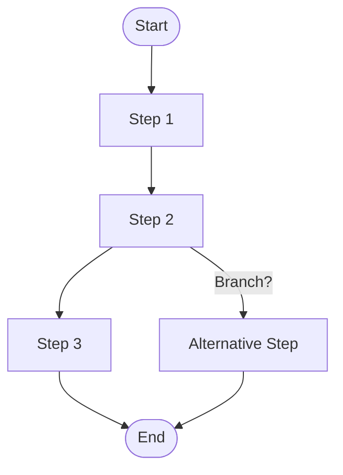

# Factor 8: Own Your Control Flow

## Overview

This example demonstrates how the Mastra workflow implementation fulfills **Factor 8: Own Your Control Flow** from the [12-Factor Agents methodology](https://github.com/humanlayer/12-factor-agents/blob/main/content/factor-08-own-your-control-flow.md).

## What Factor 8 Means

Factor 8 advocates for explicit, developer-controlled execution flow rather than relying on framework-hidden or LLM-driven control flow. You should own and control how your agent processes execute, with clear, predictable sequences that you can debug, test, and modify.

## How This Example Fulfills Factor 8

### 🎯 Explicit Step Definition

```typescript
// Each step is explicitly defined with clear inputs and outputs
const stepOne = createStep({
  id: 'stepOne',
  inputSchema: z.object({}),
  outputSchema: z.object({ result: z.string() }),
  async execute({ inputData }) {
    console.log('Step 1: Start');
    return { result: 'First step complete.' };
  },
});
```

### 🔗 Controlled Flow Composition

```typescript
// Explicit chaining of steps - you control the order
const workflow = createWorkflow({
  id: 'custom-control-flow',
  steps: [stepOne, stepTwo, stepThree],
})
  .then(stepOne) // Step 1 executes first
  .then(stepTwo) // Step 2 executes after Step 1
  .then(stepThree) // Step 3 executes after Step 2
  .commit();
```

### 📊 Transparent Execution Logging

```typescript
// Each step logs its progress explicitly
console.log('Step 1: Start');
console.log('Step 2:', inputData.result);
console.log('Step 3:', inputData.result);
```

### 🔧 Key Implementation Details

1. **Explicit Step Order**: Developer defines exact sequence of operations
2. **Clear Data Flow**: Each step's input/output explicitly defined
3. **Transparent Logging**: Progress and state changes are visible
4. **Deterministic Execution**: Same inputs always produce same flow
5. **Direct Control**: No hidden framework logic or LLM-driven routing

### 🏗️ Architecture Benefits

- **Predictability**: Flow executes exactly as defined by developer
- **Debuggability**: Each step can be inspected and tested independently
- **Maintainability**: Clear understanding of execution paths
- **Reliability**: No unexpected flow changes or LLM-driven routing
- **Testability**: Individual steps and entire flows can be unit tested

### 🔗 Explicit Workflow Control



_Figure: Each step and branch in the workflow is explicitly defined and controlled by the developer._

## Best Practices Demonstrated

### ✅ Step-by-Step Progression

```typescript
// Clear progression with logging at each step
async execute({ inputData }) {
  console.log('Step 1: Start');
  return { result: 'First step complete.' };
}
```

- Each step logs its execution for visibility
- Clear indication of progress through the workflow

### ✅ Explicit Data Passing

```typescript
// Data flows explicitly from step to step
const stepTwo = createStep({
  inputSchema: z.object({ result: z.string() }), // Expects output from stepOne
  outputSchema: z.object({ result: z.string() }),
  async execute({ inputData }) {
    console.log('Step 2:', inputData.result); // Uses previous step's output
    return { result: 'Second step complete.' };
  },
});
```

- Input schemas define expected data from previous steps
- No hidden or implicit data dependencies

### ✅ Controlled Workflow Definition

```typescript
// Developer explicitly defines the workflow structure
const workflow = createWorkflow({
  steps: [stepOne, stepTwo, stepThree], // All steps declared
})
  .then(stepOne) // Explicit ordering
  .then(stepTwo)
  .then(stepThree)
  .commit();
```

- Complete visibility into workflow structure
- No framework-hidden execution logic

## Control Flow Patterns

### Sequential Processing

```typescript
const sequentialWorkflow = createWorkflow({
  steps: [stepA, stepB, stepC],
})
  .then(stepA)
  .then(stepB)
  .then(stepC)
  .commit();
```

### Conditional Branching

```typescript
const conditionalStep = createStep({
  id: 'conditional',
  async execute({ inputData }) {
    if (inputData.condition) {
      console.log('Taking branch A');
      return { result: 'Branch A result' };
    } else {
      console.log('Taking branch B');
      return { result: 'Branch B result' };
    }
  },
});
```

### Error Handling Flow

```typescript
const errorHandlingStep = createStep({
  id: 'with-error-handling',
  async execute({ inputData }) {
    try {
      console.log('Attempting risky operation');
      return await riskyOperation(inputData);
    } catch (error) {
      console.log('Handling error:', error.message);
      return { result: 'Error handled gracefully' };
    }
  },
});
```

## Anti-Patterns Avoided

❌ **Framework-Hidden Control Flow**: No opaque execution paths hidden in frameworks
❌ **LLM-Driven Routing**: No unpredictable flow changes based on LLM decisions
❌ **Implicit Dependencies**: No hidden connections between steps
❌ **Black Box Execution**: No steps that can't be inspected or debugged

## Related Factors

This example connects to other 12-factor principles:

- **Factor 1** (Natural Language to Tool Calls) - tools execute within controlled flow
- **Factor 4** (Tools are Structured Outputs) - structured data flows between steps
- **Factor 6** (Launch/Pause/Resume) - controlled flow enables suspension/resumption
- **Factor 9** (Compact Errors) - explicit error handling in controlled flow

## Flow Design Considerations

1. **Step Granularity**: Balance between fine-grained control and complexity
2. **Error Propagation**: How errors flow through the execution chain
3. **Parallel Execution**: When steps can run concurrently vs. sequentially
4. **State Management**: How state flows between steps
5. **Testing Strategy**: How to test individual steps and complete flows

## Advanced Control Flow Patterns

### Data Transformation Pipeline

```typescript
const transformPipeline = createWorkflow({
  steps: [validateInput, transformData, validateOutput],
})
  .then(validateInput)
  .then(transformData)
  .then(validateOutput)
  .commit();
```

### Multi-Step Business Process

```typescript
const businessProcess = createWorkflow({
  steps: [gatherRequirements, processRequest, notifyStakeholders],
})
  .then(gatherRequirements)
  .then(processRequest)
  .then(notifyStakeholders)
  .commit();
```
