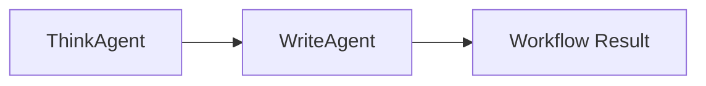

# Factor 10: Small, Focused Agents

## Overview

This example demonstrates how the Mastra agent implementation fulfills **Factor 10: Small, Focused Agents** from the [12-Factor Agents methodology](https://github.com/humanlayer/12-factor-agents/blob/main/content/factor-10-small-focused-agents.md).

## What Factor 10 Means

Factor 10 advocates for creating small, specialized agents that excel at specific tasks rather than building monolithic agents that try to handle everything. Each agent should have a clear, focused purpose and work together with other agents to accomplish larger goals.

## How This Example Fulfills Factor 10

### 🎯 Specialized Agent Definitions

```typescript
// Agent focused solely on thinking/analysis
const thinkAgent = new Agent({
  name: 'ThinkAgent',
  instructions: 'You think about a topic.',
  model,
});

// Agent focused solely on writing/output
const writeAgent = new Agent({
  name: 'WriteAgent',
  instructions: 'You write about a topic.',
  model,
});
```

### 🔗 Agent Collaboration

```typescript
// First agent handles thinking phase
const thoughts = await thinkAgent.generate('cats');
console.log('ThinkAgent output:', thoughts.text);

// Second agent handles writing phase
const writing = await writeAgent.generate(thoughts.text);
console.log('WriteAgent output:', writing.text);
```

### 🧩 Modular Workflow

```typescript
// Simple pipeline: Think → Write
// Each agent has a single responsibility
// Output of one becomes input to the next
console.log('Workflow result:', writing.text);
```

### 🔧 Key Implementation Details

1. **Single Responsibility**: Each agent has one clear purpose
2. **Minimal Instructions**: Simple, focused instructions for each agent
3. **Clear Boundaries**: Well-defined input/output between agents
4. **Composable Design**: Agents can be combined in different ways
5. **Independent Operation**: Each agent can be tested and used separately

### 🏗️ Architecture Benefits

- **Maintainability**: Small agents are easier to understand and modify
- **Testability**: Individual agents can be tested in isolation
- **Reusability**: Focused agents can be reused in different contexts
- **Debugging**: Issues can be isolated to specific agents
- **Scalability**: Different agents can be scaled independently

### 🧩 Small, Focused Agent Pipeline



_Figure: Each agent has a single responsibility. The output of one agent becomes the input to the next, forming a modular pipeline._

## Best Practices Demonstrated

### ✅ Clear Agent Purpose

```typescript
// Each agent has a specific, well-defined role
const thinkAgent = new Agent({
  name: 'ThinkAgent',
  instructions: 'You think about a topic.', // Simple, focused instruction
  model,
});
```

- Agent name clearly indicates its function
- Instructions are simple and unambiguous

### ✅ Minimal Configuration

```typescript
// No complex tool sets or extensive instructions
const writeAgent = new Agent({
  name: 'WriteAgent',
  instructions: 'You write about a topic.',
  model,
});
```

- Agents are configured with only what they need
- No unnecessary complexity or features

### ✅ Sequential Composition

```typescript
// Clear pipeline: output of one feeds into the next
const thoughts = await thinkAgent.generate('cats');
const writing = await writeAgent.generate(thoughts.text);
```

- Simple data flow between agents
- Each step builds on the previous one

## Agent Design Patterns

### Analysis → Action Pattern

```typescript
const analysisAgent = new Agent({
  name: 'AnalysisAgent',
  instructions: 'Analyze the given data and identify key patterns.',
  model,
});

const actionAgent = new Agent({
  name: 'ActionAgent',
  instructions: 'Based on analysis, recommend specific actions.',
  model,
});

// Usage
const analysis = await analysisAgent.generate(data);
const recommendations = await actionAgent.generate(analysis.text);
```

### Validation → Processing Pattern

```typescript
const validationAgent = new Agent({
  name: 'ValidationAgent',
  instructions: 'Validate input data for completeness and accuracy.',
  model,
});

const processingAgent = new Agent({
  name: 'ProcessingAgent',
  instructions: 'Process validated data according to business rules.',
  model,
});

// Usage
const validationResult = await validationAgent.generate(inputData);
if (validationResult.text.includes('valid')) {
  const processed = await processingAgent.generate(inputData);
}
```

### Summarization → Decision Pattern

```typescript
const summaryAgent = new Agent({
  name: 'SummaryAgent',
  instructions: 'Summarize key information from the provided content.',
  model,
});

const decisionAgent = new Agent({
  name: 'DecisionAgent',
  instructions: 'Make decisions based on summarized information.',
  model,
});

// Usage
const summary = await summaryAgent.generate(longContent);
const decision = await decisionAgent.generate(summary.text);
```

## Anti-Patterns Avoided

❌ **Monolithic Agents**: No single agent trying to handle multiple responsibilities
❌ **Complex Instructions**: No overly detailed or conflicting instructions
❌ **Heavy Tool Dependencies**: No agents loaded with unnecessary tools
❌ **Unclear Boundaries**: No ambiguity about what each agent should do

## Related Factors

This example connects to other 12-factor principles:

- **Factor 1** (Natural Language to Tool Calls) - each agent uses tools appropriately for its purpose
- **Factor 2** (Own Your Prompts) - focused instructions for each agent
- **Factor 8** (Own Your Control Flow) - clear control flow between agents
- **Factor 4** (Tools are Structured Outputs) - agents produce clear outputs for the next step

## Agent Composition Strategies

### Pipeline Composition

```typescript
// Linear chain of specialized agents
const pipeline = async (input: string) => {
  const step1 = await agent1.generate(input);
  const step2 = await agent2.generate(step1.text);
  const step3 = await agent3.generate(step2.text);
  return step3.text;
};
```

### Parallel Composition

```typescript
// Multiple agents working on different aspects
const parallelAnalysis = async (input: string) => {
  const [technical, business, legal] = await Promise.all([
    technicalAgent.generate(input),
    businessAgent.generate(input),
    legalAgent.generate(input),
  ]);

  return {
    technical: technical.text,
    business: business.text,
    legal: legal.text,
  };
};
```

### Conditional Composition

```typescript
// Route to different agents based on input
const routeToAgent = async (input: string, type: string) => {
  switch (type) {
    case 'analysis':
      return await analysisAgent.generate(input);
    case 'creative':
      return await creativeAgent.generate(input);
    case 'technical':
      return await technicalAgent.generate(input);
    default:
      return await generalAgent.generate(input);
  }
};
```

## Benefits for Different Use Cases

### Content Creation Pipeline

```typescript
const researchAgent = new Agent({
  instructions: 'Research the given topic and gather key facts.',
});

const outlineAgent = new Agent({
  instructions: 'Create a structured outline based on research.',
});

const writingAgent = new Agent({
  instructions: 'Write content following the provided outline.',
});

const editingAgent = new Agent({
  instructions: 'Edit and polish the written content.',
});
```

### Data Processing Workflow

```typescript
const extractionAgent = new Agent({
  instructions: 'Extract relevant data from unstructured sources.',
});

const validationAgent = new Agent({
  instructions: 'Validate extracted data for accuracy.',
});

const transformationAgent = new Agent({
  instructions: 'Transform data into the required format.',
});

const storageAgent = new Agent({
  instructions: 'Prepare data for storage in the target system.',
});
```

### Customer Service Chain

```typescript
const triageAgent = new Agent({
  instructions: 'Classify customer inquiries by type and urgency.',
});

const resolutionAgent = new Agent({
  instructions: 'Provide solutions for common customer issues.',
});

const escalationAgent = new Agent({
  instructions: 'Handle complex issues requiring human intervention.',
});
```

## Design Considerations

1. **Agent Boundaries**: Clear definition of what each agent handles
2. **Interface Design**: How agents communicate with each other
3. **Error Handling**: How failures in one agent affect others
4. **Performance**: Latency implications of multi-agent workflows
5. **Monitoring**: Tracking performance of individual agents

This implementation demonstrates how Mastra enables the creation of focused, specialized agents that work together effectively, avoiding the complexity and maintainability issues of monolithic agent designs.

## Usage

You can run this example from the command line, providing a topic as an argument or interactively:

```sh
pnpm exec tsx src/factor10-small-focused-agents/index.ts -- 'cats'
```

If you do not provide a topic, you will be prompted to enter one interactively, and asked to approve the writing step.

### Example Output

```text
ThinkAgent output: Sure, I can help with that! To provide the best assistance, I'll need a bit more information. Here are a few ways we can proceed:

1. **Specific Topic**: If you have a specific topic in mind, let me know what it is. For example, you might be interested in space exploration, climate change, artificial intelligence, or historical events.

2. **General Area of Interest**: If you're not sure about a specific topic, we can start with a broader area. For instance, you might be interested in science, literature, technology, or current events.

3. **Questions or Aspects**: If there are particular questions or aspects of a topic you're curious about, let me know. For example, you might want to know about the latest developments in a field, the history of a concept, or the implications of a recent event.

4. **Brainstorming**: If you're open to suggestions, I can provide a list of interesting topics across various fields.

Once you provide more details, I can give you a more tailored response.
Approve writing about these thoughts? (y/n): y

WriteAgent output: Let's go with option 4: Brainstorming. Here are some interesting topics across various fields that we could explore. I've grouped them into categories for easier navigation:

**Science and Technology:**

1. **Space Exploration**: The latest missions to Mars, the search for extraterrestrial life, or the future of space tourism.
2. **Artificial Intelligence**: The ethics of AI, recent advancements in machine learning, or the potential impacts of AI on society.
3. **Climate Change**: Current trends, innovative solutions, or the role of policy and activism.
4. **Biotechnology**: CRISPR and gene editing, the future of personalised medicine, or the ethics of bioengineering.
5. **Quantum Computing**: The basics of quantum computing, recent breakthroughs, or the potential applications and implications.

**History and Culture:**

1. **Ancient Civilisations**: The mysteries of the Maya, the legacy of the Roman Empire, or the achievements of ancient China.
2. **Art History**: The evolution of art movements, the lives of famous artists, or the significance of iconic artworks.
3. **Historical Events**: The causes and consequences of major events like the French Revolution, World War II, or the fall of the Berlin Wall.
4. **Cultural Phenomena**: The impact of social media on society, the evolution of music genres, or the influence of popular culture on fashion.

**Current Events and Social Issues:**

1. **Global Politics**: The dynamics of international relations, the role of international organisations, or the impacts of political ideologies.
2. **Economic Trends**: The gig economy, the future of work, or the implications of economic inequality.
3. **Social Justice**: The fight for racial equality, the progress of the LGBTQ+ rights movement, or the struggle for gender equality.
4. **Public Health**: The ongoing COVID-19 pandemic, the challenges of global health equity, or the future of healthcare technology.

**Literature and Philosophy:**

1. **Classic Literature**: The themes and significance of works like "Pride and Prejudice," "1984," or "To Kill a Mockingbird."
2. **Philosophical Ideas**: The concepts of existentialism, utilitarianism, or the philosophy of mind.
3. **Contemporary Literature**: The works of modern authors, the evolution of literary genres, or the impact of digital media on literature.

Please choose a topic that interests you, or let me know if you'd like more suggestions in a specific category. Once you've chosen a topic, we can dive deeper into the subject matter.

Workflow result: Let's go with option 4: Brainstorming. Here are some interesting topics across various fields that we could explore. I've grouped them into categories for easier navigation:

**Science and Technology:**

1. **Space Exploration**: The latest missions to Mars, the search for extraterrestrial life, or the future of space tourism.
2. **Artificial Intelligence**: The ethics of AI, recent advancements in machine learning, or the potential impacts of AI on society.
3. **Climate Change**: Current trends, innovative solutions, or the role of policy and activism.
4. **Biotechnology**: CRISPR and gene editing, the future of personalised medicine, or the ethics of bioengineering.
5. **Quantum Computing**: The basics of quantum computing, recent breakthroughs, or the potential applications and implications.

**History and Culture:**

1. **Ancient Civilisations**: The mysteries of the Maya, the legacy of the Roman Empire, or the achievements of ancient China.
2. **Art History**: The evolution of art movements, the lives of famous artists, or the significance of iconic artworks.
3. **Historical Events**: The causes and consequences of major events like the French Revolution, World War II, or the fall of the Berlin Wall.
4. **Cultural Phenomena**: The impact of social media on society, the evolution of music genres, or the influence of popular culture on fashion.

**Current Events and Social Issues:**

1. **Global Politics**: The dynamics of international relations, the role of international organisations, or the impacts of political ideologies.
2. **Economic Trends**: The gig economy, the future of work, or the implications of economic inequality.
3. **Social Justice**: The fight for racial equality, the progress of the LGBTQ+ rights movement, or the struggle for gender equality.
4. **Public Health**: The ongoing COVID-19 pandemic, the challenges of global health equity, or the future of healthcare technology.

**Literature and Philosophy:**

1. **Classic Literature**: The themes and significance of works like "Pride and Prejudice," "1984," or "To Kill a Mockingbird."
2. **Philosophical Ideas**: The concepts of existentialism, utilitarianism, or the philosophy of mind.
3. **Contemporary Literature**: The works of modern authors, the evolution of literary genres, or the impact of digital media on literature.

Please choose a topic that interests you, or let me know if you'd like more suggestions in a specific category. Once you've chosen a topic, we can dive deeper into the subject matter.
```
