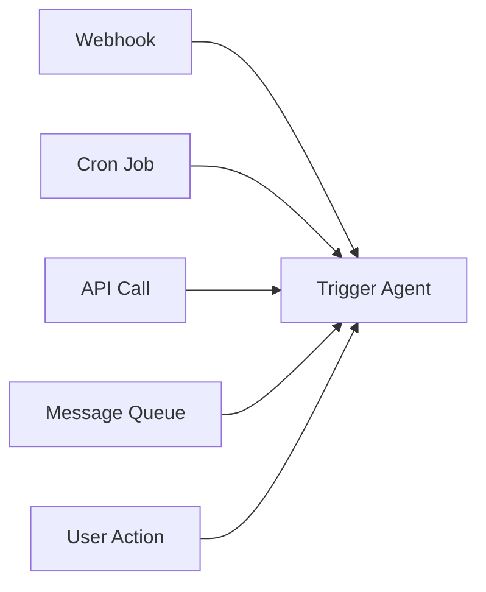

# Factor 11: Trigger from Anywhere

## Overview

This example demonstrates how the Mastra agent implementation fulfills **Factor 11: Trigger from Anywhere** from the [12-Factor Agents methodology](https://github.com/humanlayer/12-factor-agents/blob/main/content/factor-11-trigger-from-anywhere.md).

## What Factor 11 Means

Factor 11 advocates for agents that can be triggered from any source - webhooks, APIs, scheduled events, user interactions, or external systems. Your agents should be designed as event-driven services that can respond to triggers from anywhere in your infrastructure without being tightly coupled to specific trigger mechanisms.

## How This Example Fulfills Factor 11

### 🌐 Event-Driven Triggers



_Figure: The agent can be triggered from any source—webhooks, scheduled jobs, APIs, queues, or user actions—using a unified interface._

### 🌐 Event-Driven Agent Design

```typescript
const agent = new Agent({
  name: 'Trigger Agent',
  instructions: 'Handle external events and respond.',
  model,
});
```

### 🔗 Universal Event Processing

```typescript
// Simulate an external event (e.g., webhook, API call, etc.)
const event = 'external_api_call';
console.log('Received external event:', event);
const result = await agent.generate(`Handle event: ${event}`);
console.log('Agent response:', result.text);
```

### ⚡ Flexible Event Sources

```typescript
// Agent can be triggered from any source
// - HTTP webhooks
// - Message queues
// - Scheduled cron jobs
// - Database changes
// - User interactions
// - External APIs
```

### 🔧 Key Implementation Details

1. **Decoupled Design**: Agent doesn't know or care about the trigger source
2. **Event Abstraction**: All triggers are abstracted as simple events
3. **Unified Interface**: Same agent.generate() method regardless of trigger
4. **Flexible Input**: Agent accepts any string input from any source
5. **Standard Response**: Consistent output format regardless of trigger

### 🏗️ Architecture Benefits

- **Flexibility**: Agent can be integrated into any system or workflow
- **Reusability**: Same agent works with multiple trigger mechanisms
- **Scalability**: Easy to add new trigger sources without changing agent code
- **Maintenance**: Single agent codebase serves multiple integration points
- **Testing**: Agent can be tested independently of trigger mechanisms

## Best Practices Demonstrated

### ✅ Source-Agnostic Design

```typescript
// Agent doesn't need to know where the event came from
const agent = new Agent({
  name: 'Trigger Agent',
  instructions: 'Handle external events and respond.',
  model,
});
```

- Agent logic is independent of trigger source
- Same agent handles all types of events

### ✅ Event Normalization

```typescript
// Simple event format that works for any trigger
const event = 'external_api_call';
const result = await agent.generate(`Handle event: ${event}`);
```

- Events are normalized to simple string format
- Agent processes events consistently

### ✅ Logging and Monitoring

```typescript
console.log('Received external event:', event);
console.log('Agent response:', result.text);
```

- Clear logging of trigger events and responses
- Enables monitoring across all trigger sources

## Trigger Integration Patterns

### HTTP Webhook Handler

```typescript
// Express.js webhook endpoint
app.post('/webhook', async (req, res) => {
  const event = `webhook: ${req.body.type}`;
  console.log('Webhook triggered:', event);

  const response = await agent.generate(`Handle event: ${event}`);

  res.json({ success: true, response: response.text });
});
```

### Message Queue Consumer

```typescript
// Message queue integration
messageQueue.subscribe('agent-events', async (message) => {
  const event = `queue: ${message.type}`;
  console.log('Queue event received:', event);

  const response = await agent.generate(`Handle event: ${event}`);

  // Process response or send to another queue
  await processResponse(response.text);
});
```

### Scheduled Task

```typescript
// Cron job or scheduled trigger
cron.schedule('0 */6 * * *', async () => {
  const event = 'scheduled: daily-report';
  console.log('Scheduled task triggered:', event);

  const response = await agent.generate(`Handle event: ${event}`);

  // Send report via email or store in database
  await sendReport(response.text);
});
```

### Database Change Handler

```typescript
// Database trigger integration
database.onChange('users', async (change) => {
  const event = `database: user-${change.type}`;
  console.log('Database change detected:', event);

  const response = await agent.generate(`Handle event: ${event}`);

  // Update related systems or send notifications
  await notifyRelatedSystems(response.text);
});
```

### Real-time Event Stream

```typescript
// WebSocket or real-time event handling
eventStream.on('data', async (data) => {
  const event = `stream: ${data.eventType}`;
  console.log('Stream event received:', event);

  const response = await agent.generate(`Handle event: ${event}`);

  // Broadcast response to connected clients
  eventStream.broadcast(response.text);
});
```

## Anti-Patterns Avoided

❌ **Trigger-Specific Agents**: No agents built only for specific trigger types
❌ **Tight Coupling**: No direct dependencies on trigger mechanisms
❌ **Format Dependencies**: No reliance on specific event formats
❌ **Source Awareness**: No agent logic that depends on knowing the trigger source

## Related Factors

This example connects to other 12-factor principles:

- **Factor 6** (Launch/Pause/Resume) - triggered workflows can be suspended/resumed
- **Factor 8** (Own Your Control Flow) - consistent execution regardless of trigger
- **Factor 10** (Small, Focused Agents) - focused agents triggered from anywhere
- **Factor 12** (Stateless Reducer) - stateless processing of triggered events

## Event Design Considerations

1. **Event Format**: Standardize how events are represented
2. **Event Context**: Include necessary context without coupling to source
3. **Error Handling**: How to handle failures in event processing
4. **Rate Limiting**: Manage high-frequency triggers
5. **Security**: Authenticate and authorize trigger sources

## Advanced Trigger Patterns

### Multi-Source Event Router

```typescript
class EventRouter {
  private agent: Agent;

  constructor(agent: Agent) {
    this.agent = agent;
  }

  async handleEvent(source: string, data: any) {
    const event = `${source}: ${JSON.stringify(data)}`;
    console.log('Event routed from', source);

    const response = await this.agent.generate(`Handle event: ${event}`);

    return {
      source,
      event,
      response: response.text,
      timestamp: new Date().toISOString(),
    };
  }
}

// Usage with multiple sources
const router = new EventRouter(agent);

// HTTP webhook
app.post('/webhook', async (req, res) => {
  const result = await router.handleEvent('webhook', req.body);
  res.json(result);
});

// Message queue
messageQueue.subscribe('events', async (message) => {
  await router.handleEvent('queue', message);
});

// File system watcher
fs.watch('./uploads', async (eventType, filename) => {
  await router.handleEvent('filesystem', { eventType, filename });
});
```

### Event Aggregation

```typescript
class EventAggregator {
  private events: any[] = [];
  private batchSize = 10;
  private agent: Agent;

  constructor(agent: Agent) {
    this.agent = agent;
  }

  async addEvent(source: string, data: any) {
    this.events.push({ source, data, timestamp: Date.now() });

    if (this.events.length >= this.batchSize) {
      await this.processBatch();
    }
  }

  private async processBatch() {
    const batch = this.events.splice(0, this.batchSize);
    const event = `batch: ${JSON.stringify(batch)}`;

    const response = await this.agent.generate(`Handle event: ${event}`);
    console.log('Batch processed:', response.text);
  }
}
```

### Conditional Event Processing

```typescript
class ConditionalProcessor {
  private agent: Agent;
  private filters: Map<string, (data: any) => boolean> = new Map();

  constructor(agent: Agent) {
    this.agent = agent;
  }

  addFilter(source: string, filter: (data: any) => boolean) {
    this.filters.set(source, filter);
  }

  async processEvent(source: string, data: any) {
    const filter = this.filters.get(source);

    if (filter && !filter(data)) {
      console.log('Event filtered out:', source, data);
      return null;
    }

    const event = `${source}: ${JSON.stringify(data)}`;
    return await this.agent.generate(`Handle event: ${event}`);
  }
}

// Usage
const processor = new ConditionalProcessor(agent);

// Only process high-priority webhook events
processor.addFilter('webhook', (data) => data.priority === 'high');

// Only process error messages from queue
processor.addFilter('queue', (data) => data.level === 'error');
```

This implementation demonstrates how Mastra agents can be designed as truly universal event processors, capable of being triggered from any source while maintaining clean separation between trigger mechanisms and agent logic.

## Usage

You can run this example from the command line, providing an event as an argument or interactively:

```sh
pnpm exec tsx src/factor11-trigger-from-anywhere/index.ts -- 'external_api_call'
```

If you do not provide an event, you will be prompted to enter one interactively.

### Example Output

```text
Received external event: --
Agent response: To handle external events and respond appropriately, you need a structured approach that includes detecting the event, processing the relevant information, and taking the necessary actions. Here's a general framework to help you handle external events:

### 1. **Event Detection**
   - **Identify the Event Source**: Determine where the event is coming from (e.g., user input, sensor data, API calls, etc.).
   - **Monitoring Tools**: Use monitoring tools or services to detect events in real-time (e.g., logging systems, event listeners, etc.).

### 2. **Event Processing**
   - **Data Collection**: Gather all relevant data associated with the event.
   - **Validation**: Ensure the data is valid and complete.
   - **Parsing**: Convert the data into a usable format if necessary.

### 3. **Decision Making**
   - **Rules and Policies**: Apply predefined rules or policies to determine the appropriate response.
   - **Contextual Analysis**: Consider the context in which the event occurred to make informed decisions.

### 4. **Response Actions**
   - **Immediate Actions**: Take any immediate actions required (e.g., sending notifications, updating databases, etc.).
   - **Long-term Actions**: Plan and execute any long-term actions (e.g., generating reports, triggering workflows, etc.).

### 5. **Feedback and Logging**
   - **Logging**: Log the event and the actions taken for future reference and auditing.
   - **Feedback**: Provide feedback to the user or system that triggered the event, if applicable.

### Example Scenario: Handling a User Login Event

1. **Event Detection**:
   - **Source**: User attempts to log in via a web application.
   - **Monitoring**: The login attempt is detected by the application's authentication system.

2. **Event Processing**:
   - **Data Collection**: Collect the username and password entered by the user.
   - **Validation**: Check if the username and password are valid and not empty.
   - **Parsing**: Convert the input into a format suitable for authentication (e.g., hashing the password).

3. **Decision Making**:
   - **Rules and Policies**: Check if the user account is active and if the password matches the stored hash.
   - **Contextual Analysis**: Consider factors like the user's IP address, login history, and any security policies (e.g., multi-factor authentication).

4. **Response Actions**:
   - **Immediate Actions**: If the credentials are valid, grant access to the user. If not, display an error message.
   - **Long-term Actions**: Log the login attempt, update the user's last login time, and trigger any necessary security alerts.

5. **Feedback and Logging**:
   - **Logging**: Record the login attempt, success or failure, and any relevant details.
   - **Feedback**: Provide a success or failure message to the user.

### Tools and Technologies
- **Event-Driven Architectures**: Use frameworks like Apache Kafka, AWS Lambda, or Google Cloud Pub/Sub for event-driven systems.
- **Monitoring and Logging**: Tools like ELK Stack (Elasticsearch, Logstash, Kibana), Splunk, or Prometheus.
- **APIs and Webhooks**: Use APIs and webhooks to integrate with external systems and services.

### Best Practices
- **Scalability**: Ensure your event handling system can scale to handle increased event volumes.
- **Security**: Implement robust security measures to protect against malicious events.
- **Reliability**: Design your system to be fault-tolerant and resilient to failures.

By following this framework, you can effectively handle external events and respond in a timely and appropriate manner.
```
