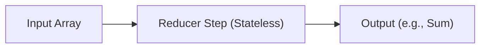

# Factor 12: Make Your Agent a Stateless Reducer

## Overview

This example demonstrates how the Mastra workflow implementation fulfills **Factor 12: Make Your Agent a Stateless Reducer** from the [12-Factor Agents methodology](https://github.com/humanlayer/12-factor-agents/blob/main/content/factor-12-stateless-reducer.md).

## What Factor 12 Means

Factor 12 advocates for designing agents as stateless reducers that take input data and produce deterministic output without relying on internal state. Like functional programming reducers, agents should be pure functions that can be run anywhere, scaled horizontally, and tested reliably without side effects or state dependencies.

## How This Example Fulfills Factor 12

### 🔄 Stateless Reducer Function

```typescript
const reducerStep = createStep({
  id: 'stateless-reducer',
  inputSchema: z.object({ values: z.array(z.number()) }),
  outputSchema: z.object({ sum: z.number() }),
  async execute({ inputData }) {
    // Pure function: same input always produces same output
    console.log('Reducer step received values:', inputData.values);
    const sum = inputData.values.reduce((acc, v) => acc + v, 0);
    return { sum };
  },
});
```

### 📊 Deterministic Data Processing

```typescript
// Input data determines output - no external state
const result = await run.start({ inputData: { values: [1, 2, 3, 4, 5] } });
// Always produces sum: 15 for this input
```

### 🧩 Functional Composition

```typescript
const workflow = createWorkflow({
  id: 'stateless-reducer-workflow',
  inputSchema: z.object({ values: z.array(z.number()) }),
  outputSchema: z.object({ sum: z.number() }),
  steps: [reducerStep],
})
  .then(reducerStep)
  .commit();
```

### 🔧 Key Implementation Details

1. **Pure Function**: Step produces same output for same input every time
2. **No Side Effects**: No external state modification or dependencies
3. **Deterministic**: Predictable behavior regardless of when/where it runs
4. **Composable**: Can be combined with other stateless operations
5. **Testable**: Easy to test with known inputs and expected outputs

### 🏗️ Architecture Benefits

- **Scalability**: Stateless operations can be scaled horizontally without coordination
- **Reliability**: No race conditions or state corruption issues
- **Testing**: Simple unit testing with predictable inputs and outputs
- **Debugging**: Easy to trace and reproduce issues
- **Deployment**: Can run anywhere without state setup or migration

### 🔄 Stateless Reducer Pipeline



_Figure: The reducer step processes the input array in a stateless, deterministic way, producing a predictable output._

## Best Practices Demonstrated

### ✅ Pure Function Design

```typescript
// No external dependencies or state modifications
async execute({ inputData }) {
  const sum = inputData.values.reduce((acc, v) => acc + v, 0);
  return { sum }; // Pure output based only on input
}
```

- Function depends only on its input parameters
- No side effects or external state changes

### ✅ Deterministic Processing

```typescript
// Same input always produces same output
const sum = inputData.values.reduce((acc, v) => acc + v, 0);
```

- Mathematical operations that are completely predictable
- No randomness or time-dependent behavior

### ✅ Input/Output Validation

```typescript
inputSchema: z.object({ values: z.array(z.number()) }),
outputSchema: z.object({ sum: z.number() }),
```

- Clear contracts for what goes in and what comes out
- Type safety ensures predictable data flow

## Stateless Reducer Patterns

### Array Processing

```typescript
const arrayProcessorStep = createStep({
  id: 'array-processor',
  inputSchema: z.object({ items: z.array(z.string()) }),
  outputSchema: z.object({ processed: z.array(z.string()) }),
  async execute({ inputData }) {
    // Pure transformation of input array
    const processed = inputData.items
      .map((item) => item.toUpperCase())
      .filter((item) => item.length > 3)
      .sort();
    return { processed };
  },
});
```

### Data Aggregation

```typescript
const aggregatorStep = createStep({
  id: 'data-aggregator',
  inputSchema: z.object({
    records: z.array(
      z.object({
        category: z.string(),
        value: z.number(),
      }),
    ),
  }),
  outputSchema: z.object({
    aggregated: z.record(z.number()),
  }),
  async execute({ inputData }) {
    // Stateless aggregation operation
    const aggregated = inputData.records.reduce(
      (acc, record) => {
        acc[record.category] = (acc[record.category] || 0) + record.value;
        return acc;
      },
      {} as Record<string, number>,
    );

    return { aggregated };
  },
});
```

### Data Transformation

```typescript
const transformerStep = createStep({
  id: 'data-transformer',
  inputSchema: z.object({
    data: z.object({
      name: z.string(),
      email: z.string(),
      age: z.number(),
    }),
  }),
  outputSchema: z.object({
    transformed: z.object({
      fullName: z.string(),
      emailDomain: z.string(),
      ageGroup: z.string(),
    }),
  }),
  async execute({ inputData }) {
    // Pure data transformation
    const { name, email, age } = inputData.data;

    const transformed = {
      fullName: name.trim(),
      emailDomain: email.split('@')[1],
      ageGroup: age < 18 ? 'minor' : age < 65 ? 'adult' : 'senior',
    };

    return { transformed };
  },
});
```

## Anti-Patterns Avoided

❌ **External State Dependencies**: No reliance on databases, files, or global variables
❌ **Side Effects**: No modifications to external systems during processing
❌ **Time Dependencies**: No behavior that changes based on current time
❌ **Random Behavior**: No non-deterministic operations

## Related Factors

This example connects to other 12-factor principles:

- **Factor 1** (Natural Language to Tool Calls) - tools as stateless operations
- **Factor 4** (Tools are Structured Outputs) - structured input/output for reducers
- **Factor 8** (Own Your Control Flow) - predictable execution flow
- **Factor 11** (Trigger from Anywhere) - stateless reducers work from any trigger

## Advanced Stateless Patterns

### Map-Reduce Implementation

```typescript
const mapStep = createStep({
  id: 'map-operation',
  inputSchema: z.object({ items: z.array(z.string()) }),
  outputSchema: z.object({ mapped: z.array(z.number()) }),
  async execute({ inputData }) {
    // Map operation: transform each item
    const mapped = inputData.items.map((item) => item.length);
    return { mapped };
  },
});

const reduceStep = createStep({
  id: 'reduce-operation',
  inputSchema: z.object({ mapped: z.array(z.number()) }),
  outputSchema: z.object({ total: z.number() }),
  async execute({ inputData }) {
    // Reduce operation: aggregate results
    const total = inputData.mapped.reduce((sum, length) => sum + length, 0);
    return { total };
  },
});

const mapReduceWorkflow = createWorkflow({
  id: 'map-reduce',
  steps: [mapStep, reduceStep],
})
  .then(mapStep)
  .then(reduceStep)
  .commit();
```

### Functional Pipeline

```typescript
const functionalPipeline = createWorkflow({
  id: 'functional-pipeline',
  steps: [validateStep, normalizeStep, transformStep, aggregateStep],
})
  .then(validateStep) // Pure validation
  .then(normalizeStep) // Pure normalization
  .then(transformStep) // Pure transformation
  .then(aggregateStep) // Pure aggregation
  .commit();

// Each step is a pure function in the pipeline
```

### Parallel Processing

```typescript
const parallelProcessorStep = createStep({
  id: 'parallel-processor',
  inputSchema: z.object({ batches: z.array(z.array(z.number())) }),
  outputSchema: z.object({ results: z.array(z.number()) }),
  async execute({ inputData }) {
    // Process batches in parallel (stateless operations)
    const results = await Promise.all(
      inputData.batches.map(async (batch) => {
        // Each batch processed independently
        return batch.reduce((sum, num) => sum + num, 0);
      }),
    );

    return { results };
  },
});
```

## Benefits for Different Use Cases

### Data Analytics

```typescript
// Stateless analytics pipeline
const analyticsReducer = createStep({
  id: 'analytics-reducer',
  async execute({ inputData }) {
    const { events } = inputData;

    const analytics = {
      totalEvents: events.length,
      uniqueUsers: new Set(events.map((e) => e.userId)).size,
      averageValue: events.reduce((sum, e) => sum + e.value, 0) / events.length,
      topCategories: getTopCategories(events),
    };

    return { analytics };
  },
});
```

### Content Processing

```typescript
// Stateless content transformation
const contentProcessor = createStep({
  id: 'content-processor',
  async execute({ inputData }) {
    const { content } = inputData;

    const processed = {
      wordCount: content.split(/\s+/).length,
      readingTime: Math.ceil(content.split(/\s+/).length / 200),
      keywords: extractKeywords(content),
      summary: generateSummary(content),
    };

    return { processed };
  },
});
```

### Business Rules Engine

```typescript
// Stateless business rule evaluation
const rulesEngine = createStep({
  id: 'rules-engine',
  async execute({ inputData }) {
    const { transaction, rules } = inputData;

    const evaluation = rules.map((rule) => ({
      ruleId: rule.id,
      passed: evaluateRule(rule, transaction),
      score: calculateScore(rule, transaction),
    }));

    const overallResult = {
      passed: evaluation.every((e) => e.passed),
      score: evaluation.reduce((sum, e) => sum + e.score, 0),
      details: evaluation,
    };

    return { evaluation: overallResult };
  },
});
```

## Testing Stateless Reducers

```typescript
describe('Stateless Reducer', () => {
  it('should produce consistent results', async () => {
    const input = { values: [1, 2, 3, 4, 5] };

    const result1 = await reducerStep.execute({ inputData: input });
    const result2 = await reducerStep.execute({ inputData: input });

    expect(result1).toEqual(result2);
    expect(result1.sum).toBe(15);
  });

  it('should handle empty arrays', async () => {
    const input = { values: [] };
    const result = await reducerStep.execute({ inputData: input });
    expect(result.sum).toBe(0);
  });

  it('should handle large datasets', async () => {
    const largeArray = Array.from({ length: 10000 }, (_, i) => i + 1);
    const input = { values: largeArray };
    const result = await reducerStep.execute({ inputData: input });
    expect(result.sum).toBe(50005000); // Sum of 1 to 10000
  });
});
```

This implementation demonstrates how Mastra enables the creation of truly stateless, functional agents that operate as pure reducers, providing scalability, reliability, and predictability while avoiding the complexity of stateful operations.

## Usage

You can run this example from the command line, providing a list of numbers as arguments or interactively:

```sh
pnpm exec tsx src/factor12-stateless-reducer/index.ts -- 1 2 3 4 5
```

If you do not provide numbers, you will be prompted to enter them interactively.

### Example Output

```text
Reducer input values: [ 1, 2, 3, 4, 5 ]
Reducer step received values: [ 1, 2, 3, 4, 5 ]
Reducer output: { sum: 15 }
Workflow result: { sum: 15 }
```
